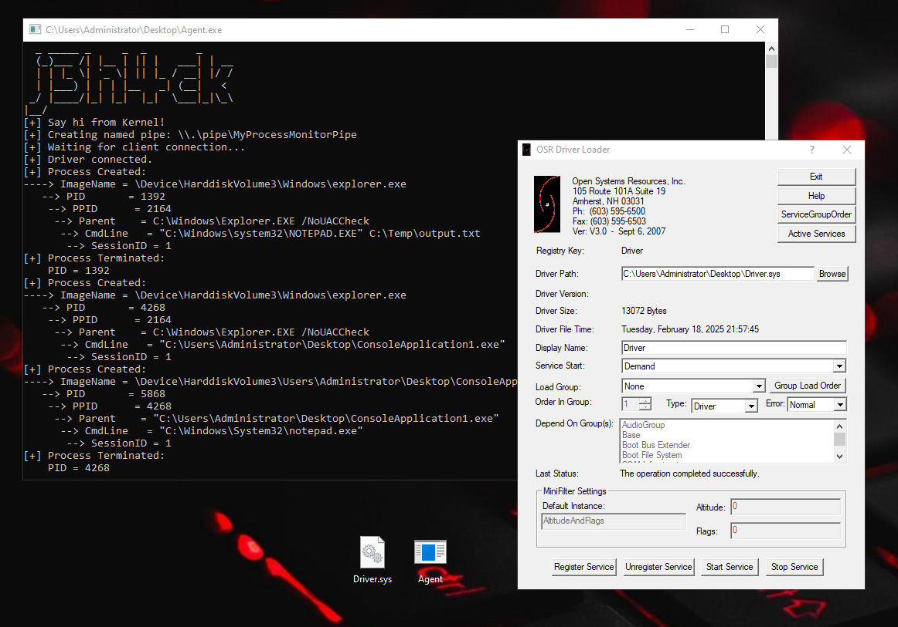

# MiniEDR by @j3h4ck



## Overview

This project is a **fun and educational** experiment to dive deep into **malware development** by understanding how the **Windows kernel** and **Endpoint Detection and Response (EDR)** mechanisms work.  
It monitors **process creation and termination**, sending details to a user-mode application through a **named pipe**.

## Features

- ✅ Monitors **process creation** and **termination**
- ✅ Retrieves **process image name, parent process, command line, and session ID**
- ✅ Sends data to a **user-mode application** via a **named pipe**
- ✅ Built **for learning and research purposes**
- ✅ Helps understand **kernel development and EDR mechanisms**

## Components

- **Kernel Driver** 🖥️: Hooks into process creation and termination events.
- **User-mode Application** 📡: Reads process activity data from the named pipe.

## Building the Project 🛠️

To build the project yourself, you will need:

- **Windows Driver Kit (WDK)**
- **Visual Studio 2022** with the WDK extension installed

### Steps:

1. Open **Visual Studio 2022**.
2. Load the project and set the **WDK environment**.
3. Build the **driver (.sys)** and the **user-mode application (.exe)**.

Alternatively, you can **download the pre-built binaries** from the **Releases** section.

## Running the Driver 🚀

You can load the driver using one of the following methods:

### 1️⃣ OSR Driver Loader (Easier Method)
1. Download **OSR Driver Loader** from [OSR Online](https://www.osronline.com/).
2. Select the compiled `.sys` file.
3. Load the driver and start monitoring process activity.

### 2️⃣ Using `sc.exe` (Built-in Windows Method)
1. Open **Command Prompt (Administrator)**.
2. Run the following commands:

```powershell
sc create MiniEDR type= kernel binPath= C:\Path\To\MiniEDR.sys
sc start MiniEDR
⭐ **Feel free to contribute and explore how EDRs function at a lower level!** ⭐
